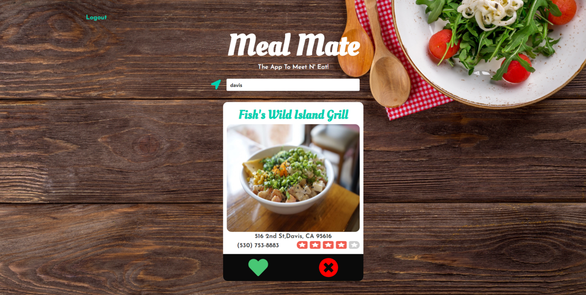

# meal-mate

"The App to Meet 'N Eat."

# Site URL

https://meal--mate.herokuapp.com

# What it is

Meal Mate is a website that aims to simplify the dinner decision.

# Technologies

- HTML / CSS / Bulma / JavaScript / Jquery / Node.js / Sequelize / Express / Handlebars

# APIs

- Yelp API: https://www.yelp.com/developers/documentation/v3

# User story

- AS two people are hungry and trying to come to a decision where to eat. I WANT an easy way to see local restaurants and compare with each other which one we like. SO THAT we can decide on a restaurant.
- GIVEN a location input
- WHEN I enter a location THEN I am given 20 restaurants inside that radius.
- WHEN I like a restaurant THEN I am submitting it for a match.
- WHEN I dislike a restaurant THEN I am shown the next restaurant near me.
- WHEN a match is made THEN we go to eat there.

# Upcoming Features

- Alert the other user if there was a match
- Have a list of restaurants that were “liked”
- Have strangers meet up
- Implement Google Maps API
- Add CSS animations

# Contributors

- Nick Hernstedt 🐀: https://github.com/nick-hernstedt
- Kayla Ward 🦋: https://github.com/kaylaw0127
- Dru Sanchez 🏍: https://github.com/Drubaloo
